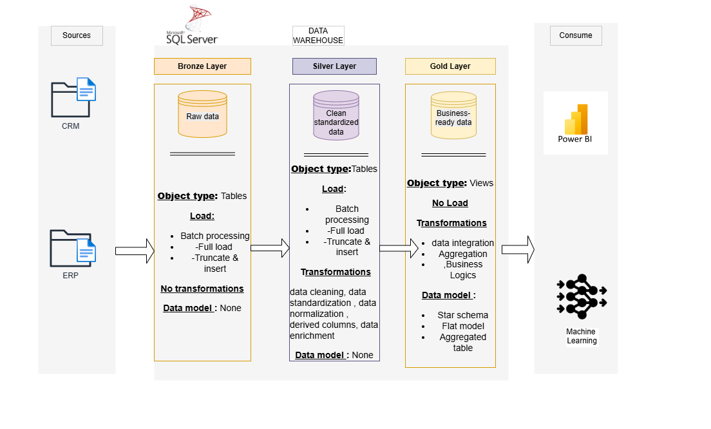
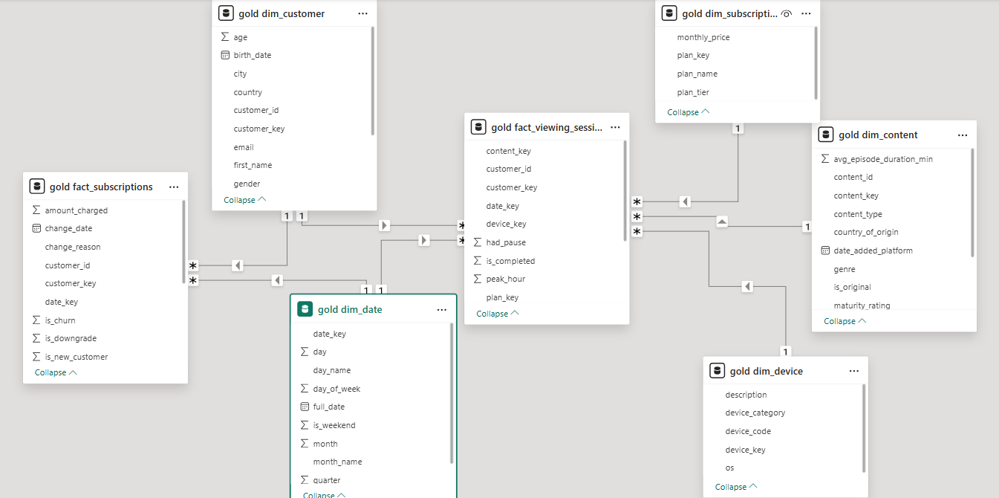

# Streamify Inc. — Data Warehouse Project

End-to-end Data Warehouse for a fictional streaming platform built with **Microsoft SQL Server**, following the **Medallion Architecture** (Bronze / Silver / Gold), containerized with **Docker**, and tested automatically via **GitHub Actions CI**, with a **Power BI** dashboard and Python AI components.

---

## Stack

| | |
|---|---|
| Database | Microsoft SQL Server 2022 |
| IDE | SQL Server Management Studio (SSMS) |
| Data Modeling | Constellation Schema |
| Containerization | Docker and Docker Compose |
| CI | GitHub Actions |
| Visualization | Power BI Desktop |
| AI | Python, scikit-learn |

---

## Project Structure

```
streamify-data-warehouse/
├── datasets/          # Raw CSV exports (CRM + ERP)
├── scripts/
│   ├── bronze/        # Raw ingestion
│   ├── silver/        # Cleaning and transformation
│   └── gold/          # Constellation Schema (Views)
├── ai/                # Recommendation + churn models and tests
├── docker/            # Dockerfiles and docker-compose.yml
├── .github/workflows/ # CI pipeline
├── powerbi/           # Power BI dashboard (.pbix)
└── data_catalog.md    # Column descriptions for the Gold layer
```

---

## Architecture

The project follows the **Medallion Architecture** with 3 layers, all running inside a SQL Server Docker container.

**Bronze** loads the 4 CSV files as-is into SQL Server. Every column is stored as `NVARCHAR`, no transformation applied. Full truncate and reload on every run.

**Silver** is where the real cleaning happens. Each source file has its own documented set of issues that are fixed here: mixed date formats (DD/MM/YYYY and Unix timestamps), inconsistent country names standardized to ISO 2-letter codes, `is_active` values normalized across 6 different formats (True/False/1/0/yes/no), invalid `birth_date` values like `1900-01-01` set to NULL, test accounts removed, and orphan foreign keys excluded before they reach the fact tables.

**Gold** exposes business-ready data modeled as a Constellation Schema through SQL Views. No data is physically stored here.


---

## Data Model

The Gold layer uses a **Constellation Schema**. Viewing sessions and subscription events are two distinct business processes that share the same customers, plans, and dates, so they each get their own fact table.




**fact_viewing_sessions** has one row per `session_id`. Raw PLAY/PAUSE/RESUME/STOP/RATE events from the ERP logs are collapsed into a single row per session, keeping only sessions with a valid STOP event and at least 2 minutes of watch time.

Key metrics: `watch_time_minutes`, `is_completed` (user watched at least 75% of the average episode duration), `rating` (from RATE events), `had_pause`, `peak_hour`.

**fact_subscriptions** has one row per subscription change event. It tracks every plan change (NEW, UPGRADE, DOWNGRADE, CANCEL, REACTIVATE) with the amount charged and payment status.

### Dimensions

| Table | Description |
|---|---|
| `dim_customer` | Customer profile, shared by both fact tables |
| `dim_subscription_plan` | Plan name, price, tier (FREE / BASIC / STANDARD / PREMIUM) |
| `dim_date` | Date calendar, shared by both fact tables |
| `dim_content` | Title, genre, type, maturity rating |
| `dim_device` | Device category and OS (10 device codes, built manually from internal reference) |

---

## Data Sources

| File | System | Description |
|---|---|---|
| `crm_customers.csv` | CRM (Salesforce) | One row per customer account |
| `crm_subscription_history.csv` | CRM (Finance) | Full history of plan changes |
| `erp_viewing_logs.csv` | ERP (App logs) | Raw viewing events (PLAY, PAUSE, RESUME, STOP, RATE) |
| `erp_content_catalog.csv` | ERP (Editorial) | Content catalog with genres and metadata |

The two source systems do not communicate with each other, which is why orphan foreign keys exist between them. The Silver layer handles this before anything reaches the Gold layer.

---

## KPIs tracked in Power BI

| KPI | Definition |
|---|---|
| Completion rate | Sessions with `is_completed = 1` / total sessions |
| Monthly retention | Users active in both M and M-1 / users active in M-1 |
| MRR | Sum of `monthly_price` for all active paying subscribers |
| Avg watch time | Sum of `watch_time_minutes` / total valid sessions |
| Churn rate | Paying customers in M-1 with no session in M / total paying customers in M-1 |

---

## Running the Project

Make sure Docker Desktop is installed, then:

```bash
git clone https://github.com/your-org/streamify-data-warehouse.git
cd streamify-data-warehouse
cp .env.example .env      # set your SA_PASSWORD inside
docker compose -f docker/docker-compose.yml up --build
```

This starts SQL Server, runs the full Bronze to Gold pipeline automatically, and executes both AI models. Connect SSMS to `localhost,1433` to explore the Gold views.

> Power BI requires the Docker stack to be running. Open `powerbi/streamify_dashboard.pbix` and connect to `localhost,1433`.

---

## CI

On every push and pull request to `main`, the pipeline spins up the full Docker stack, runs all SQL scripts from Bronze to Gold, and runs `pytest` on both AI models. A broken script or a model that drops below its accuracy threshold will fail the build before it reaches main.

---

## AI Components

A scikit-learn model reading from the Gold layer:

**Churn Prediction** flags users likely to cancel using subscription change history from `fact_subscriptions` combined with engagement signals from `fact_viewing_sessions`. The training label follows the churn KPI definition above.

---

## Power BI Dashboard


---

## Notes

- SQL scripts contain comments in French.
- The dataset is fully synthetic, covering January 2021 to December 2024.
- Never commit `.env`, use `.env.example` as a template.

---


## Author

**Abdallah Assoumanou**
4th-year student at ENSIAS, Rabat — Data Engineering

[](https://github.com/gitabdelhub)
[](https://www.linkedin.com/in/abdallah-assoumanou-354b43286)
